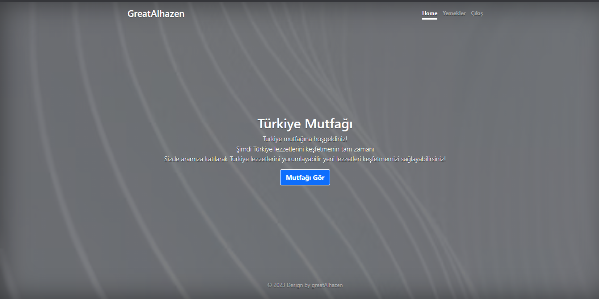
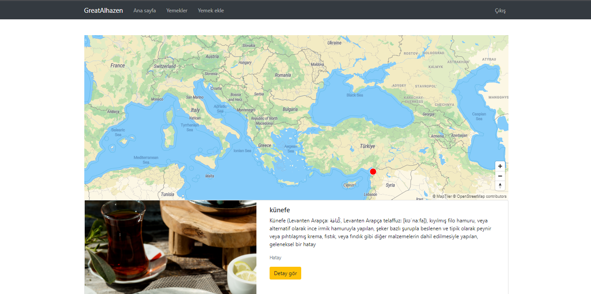
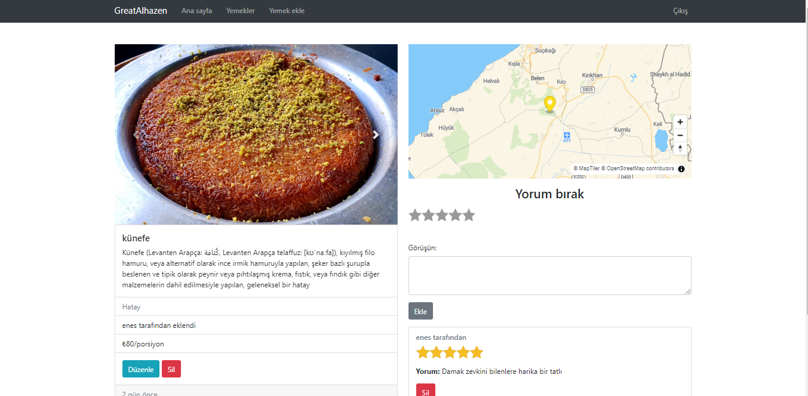
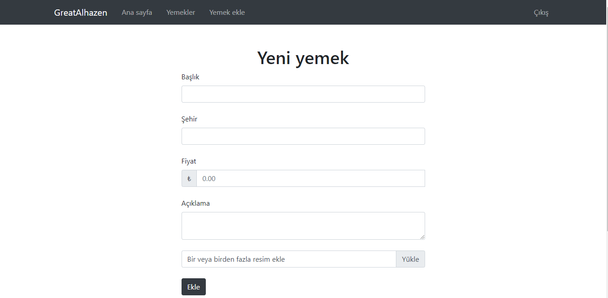

# [Turkish Cuisine Website](https://turkish-cuisine.onrender.com/)

|            Main             |           Foods            |
| :-------------------------: | :------------------------: |
|  |  |

|            Food             |             Add             |
| :-------------------------: | :-------------------------: |
|  |  |

Amazing website build with express and other web server packages.

## Links:

- [Live Preview](https://turkish-cuisine.onrender.com/)

## Installation

- Clone the repo:

```
git clone git@github.com:greatAlhazen/Turkish-Cuisine.git
```

- Get into main directory and execute this command

```
npm install
```

- In the main directory create .env file and specify these

```
PORT: <YOUR_PORT>
SESSION_SECRET: <YOUR_SESSION_SECRET>
DB_URL: <YOUR_MONGO_DB_URL>
CLOUD_NAME: <YOUR_CLOUDINARY_NAME>
CLOUD_SECRET: <YOUR_CLOUDINARY_SECRET>
CLOUD_API: <YOUR_CLOUDINARY_API_KEY>
OPENCAGE_API_KEY: <YOUR_OPENCAGE_API_KEY>
MAP_API: <YOUR_MAPTILER_API_KEY>
```

- After,get into terminal and execute this command for preview

```
npm start
```

- After those get into browser and go to specified http://localhost:<YOUR_PORT>

## Dependencies

- [cloudinary](https://cloudinary.com/documentation) - The cloud for image upload
- [connect-flash](https://github.com/jaredhanson/connect-flash) - For UI messages
- [connect-mongo](https://github.com/jdesboeufs/connect-mongo) - For session store in mongo
- [dotenv](https://github.com/motdotla/dotenv) - For specified environment variables in development mode
- [ejs](https://ejs.co/) - For UI
- [ejs-mate](https://github.com/JacksonTian/ejs-mate) - For UI boilerplate
- [express](https://expressjs.com/) - For handling http requests
- [express-mongo-sanitize](https://github.com/fiznool/express-mongo-sanitize) - For guarding mongo injection
- [express-session](https://github.com/expressjs/session) - For session store
- [helmet](https://helmetjs.github.io/) - For handling security issues
- [joi](https://joi.dev/api/?v=17.9.1) - For server-side validation
- [method-override](https://www.npmjs.com/package/method-override) - For handnling post requests
- [mongoose](https://mongoosejs.com/docs/) - For managing mongo database
- [multer](https://github.com/expressjs/multer) - For handling form-files
- [opencage-api-client](https://opencagedata.com/api) - For handling geocoding
- [passport](https://www.passportjs.org/docs/) - For configuring passport authentication package
- [passport-local](https://www.passportjs.org/docs/) - For handling authentication in local
- [passport-local-mongoose](https://github.com/saintedlama/passport-local-mongoose) - For handling authentication in local
- [sanitize-html](https://github.com/apostrophecms/sanitize-html) - For guarding script injections

## Copyright

Copyright 2023 [Enes Uraz](https://github.com/greatAlhazen)
